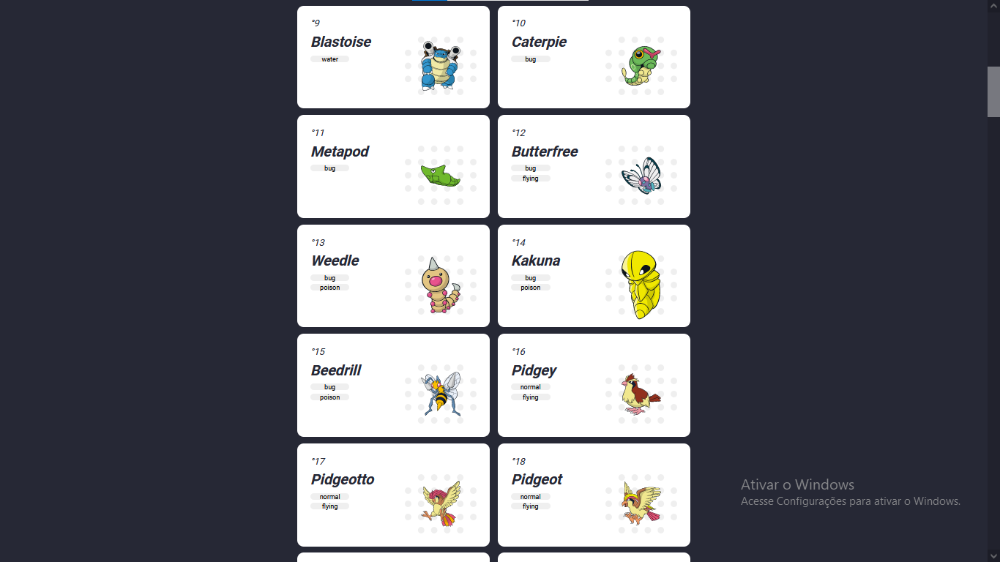

# Pokédex

Meu projeto angular-pokédex, consumindo a <a href="https://pokeapi.co/">`PokéAPI`</a>

# View

  
  

## Development server

Run `ng serve` for a dev server. Navigate to `http://localhost:4200/`. The app will automatically reload if you change any of the source files.

